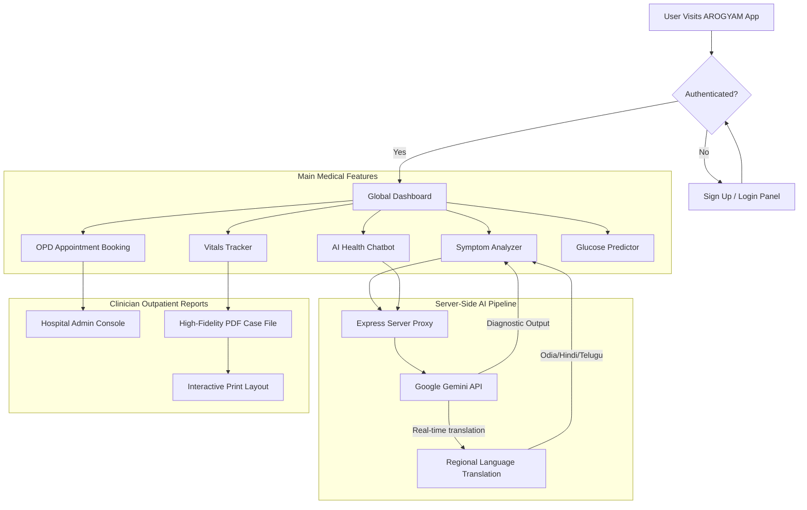

# 🩺 AROGYAM:  AI-driven Healthcare portal

AROGYAM is a modern, full-stack, AI-powered health assistant and outpatient department (OPD) management ecosystem. Built with a high-fidelity React frontend, dynamic Tailwind styling, and a powerful Node.js/Express server, AROGYAM leverages **Google Gemini APIs** to analyze symptoms, translate medical summaries in real-time, drive intuitive conversational health assistance, and predict metabolic health risks.

This platform is specifically tailored to empower individuals and health supervisors—particularly highlighting regional support in Odisha and across India with multi-language coverage (English, हिन्दी, ଓଡ଼ିଆ, etc.).

---

## 🚀 Key Features

### 1. 🤖 Intelligent Symptom Analyzer & Translator
*   **Intelligent Analysis**: Enter complex multi-symptom descriptions and receive instantly classified diagnostic possibilities with probability metrics (Low, Medium, High).
*   **Google Gemini Native Translation**: Real-time translation of diagnosis reports on-the-fly into multiple Indian regional languages, including **Odia (ଓଡ଼ିଆ)**, **Hindi (हिन्दी)**, **Bengali (বাংলা)**, **Telugu (తెలుగు)**, **Tamil (தமிழ்)**, and **Marathi (मराठी)**.
*   **Disclaimers & Urgency**: Automated urgency tiering (`Routine`, `Urgent`, `Emergency`) with non-critical physical self-care actions and doctor specialty recommendation.

### 2. 📅 Comprehensive Admin & Appointment Booking System
*   **Interactive Bookings**: Select clinical departments, screen specialized doctors, and schedule timestamps.
*   **Outpatient Ticket Receipt (PDF)**: Automated physical invoice and ticket generation with embedded barcodes and medical stamps using clinical layout formats.
*   **Admin Console**: A robust dashboard to confirm, delay, or cancel appointments, filter by department queues, and check total metrics.

### 3. 📝 Live Outpatient Case File Tracker & PDF Export
*   **Vitals Logs**: Log, visualize, and track blood pressure and vital diagnostics historically.
*   **Clinical Letterhead Export**: Generate and download a highly polished outpatient case file in PDF format with signature pads, clinical headers, stamp seals, and a clean professional print style.

### 4. 🧠 Metabolic Prediction & Health Tracking
*   **Predictive Diagnostics**: Analyze blood sugar metrics, activity schedules, and BMI variables to evaluate diabetes susceptibility risks via machine learning-motivated indicators.
*   **Vitals Tracking**: Interactive charts showing historical telemetry for systolic/diastolic pressure and active heart rate indices.

### 5. 🗺️ Find Care & Nearby Facilities
*   **Location-Aware Care Finders**: Find nearby clinics, multi-specialty regional hospitals, and round-the-clock pharmacies (with focus regions in Bhubaneswar, Odisha).

### 6. 💬 Arogyam Companion AI Chatbot
*   **Contextual Companion**: Connected server-side directly to Google Gemini instance to guide users on appointment workflows, map lookups, core calculations, and physical self-care rules.

---

## 🛠️ Architecture & Flowchart

The following flowchart describes the full user lifecycle and interactions inside the AROGYAM Outpatient App:



---

## 💻 Powered By (Tech Stack)

### **Frontend Framework & Styling**
*   **React 18** (TypeScript, modern functional components, hooks, ref trackers)
*   **Tailwind CSS** (Utility-first fluid layouts, dark-mode variations, responsive UI)
*   **jsPDF** (High-precision medical prescription sheets and ticket PDF compilation)
*   **Recharts** (Interactive systolic, diastolic, and metabolic tracking charts)

### **Server Runtime**
*   **Node.js / Express** (Full-stack API proxy, dynamic static file serving, local caching handlers)
*   **tsx** (TypeScript runner for seamless runtime development)
*   **esbuild** (Bundles typescript server into standard enterprise CommonJS `dist/server.cjs`)

### **Third-Party Medical APIs**
*   **Google Gen AI (Gemini 3.5 Flash SDK)**: Directly processes natural clinical descriptions, evaluates diagnostic probability structures, translates report values, and commands the chat companion using state-of-the-art inference loops.

---

## 📝 Configuration & Local Development

### Prerequisites
*   Make sure you have [Node.js](https://nodejs.org/) installed (v18+ recommended).

### 1. Environment Set Up
Create a `.env` file in the root directory (based on `.env.example`):
```env
PORT=3000
GEMINI_API_KEY=your_google_gemini_api_key_here
```

### 2. Install Dependencies
Run the following script to acquire all package trees:
```bash
npm install
```

### 3. Run Development Server
Launches the full-stack server on port 3050/3000 (proxied via Vite):
```bash
npm run dev
```

### 4. Compiling the Production Build
Optimizes the React client and compiles the Express `server.ts` into a lightweight, self-contained single file under `dist/server.cjs`:
```bash
npm run build
```

### 5. Start Standard Build
Launches the compiled production app:
```bash
npm start
```

---

## 📜 Standard Disclaimer
AROGYAM is built strictly as a simulated, intelligent educational and decision-support reference. Results provided by the Gemini AI models and machine learning predictors do not constitute definitive medical advice or professional clinical diagnostics. Users should always consult a licensed general physician or qualified therapeutic professional before pursuing medical actions or altering active regimes.
